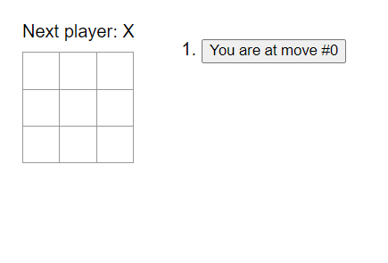
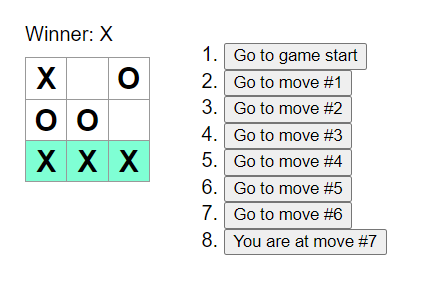

# Tic-Tac-Toe Game

This is a simple Tic-Tac-Toe game built with React. The game allows two players to play against each other and highlights the winning line when a player wins. It also displays a message when the game ends in a draw.

### This is just a small project to get familiar with working with React.

[Play the game](https://karthik-parvathaneni.github.io/Tic-Tac-Toe/)

Preview of the game:

 

## Features

- Two-player game (X and O).
- Highlights the three squares that caused the win.
- Displays a draw message if no one wins and all squares are filled.
- Allows players to navigate through the game's history and jump to a specific move.
